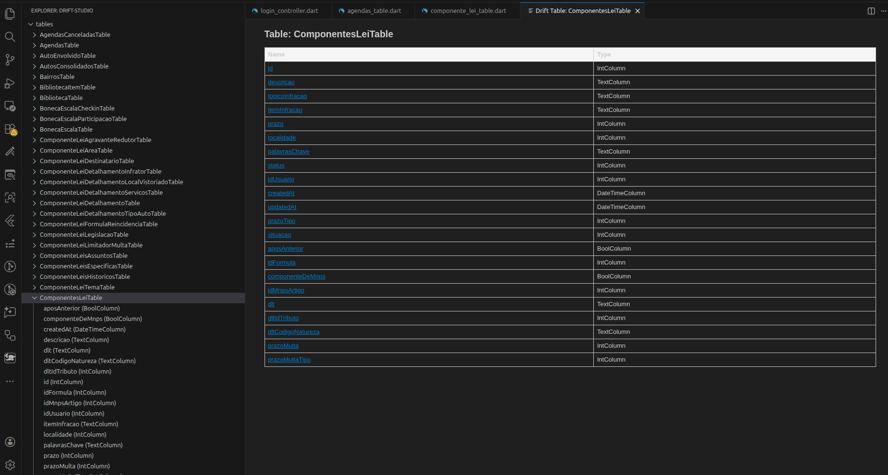

# Drift Studio for VS Code

🚀 **Explore Drift tables and columns in your Dart/Flutter project, instantly!**

## Features

- Detects and lists all Drift tables and columns in your project.
- Shows column types and organizes everything alphabetically.
- Click a column name to open the table class in your code.
- Modern, clean, and fast UI.

> New features coming soon! Stay tuned for live data editing and more.

---

---

## How to Use

1. Open your Dart/Flutter project in VS Code.
2. Click the Drift Studio icon in the Explorer.
3. Browse your tables and columns. Click a column to jump to its class.

---

## Changelog

- 0.1.0: Initial release – Drift table/column explorer, quick navigation.

---

## Feedback

Found a bug or want a feature? [Open an issue](https://github.com/your-repo/drift-studio) or leave a review!

---

# Drift Studio para VS Code

🚀 **Explore tabelas e colunas Drift no seu projeto Dart/Flutter, instantaneamente!**

## Funcionalidades

- Detecta e lista todas as tabelas e colunas Drift do seu projeto.
- Mostra os tipos das colunas e organiza tudo em ordem alfabética.
- Clique no nome de uma coluna para abrir a classe da tabela no código.
- Interface moderna, limpa e rápida.

> Novas funcionalidades em breve! Fique ligado para edição de dados ao vivo e mais.

---

## Como Usar

1. Abra seu projeto Dart/Flutter no VS Code.
2. Clique no ícone do Drift Studio no Explorer.
3. Navegue pelas tabelas e colunas. Clique em uma coluna para ir direto para a classe.

---

## Changelog

- 0.1.0: Primeira versão – Explorer de tabelas/colunas Drift, navegação rápida.

---

## Feedback

Achou um bug ou quer sugerir uma feature? [Abra uma issue](https://github.com/your-repo/drift-studio) ou deixe sua avaliação!
